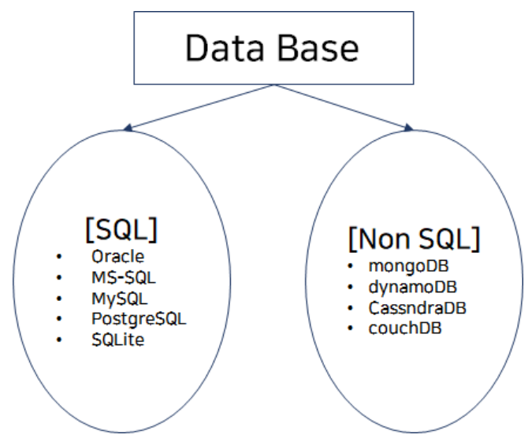
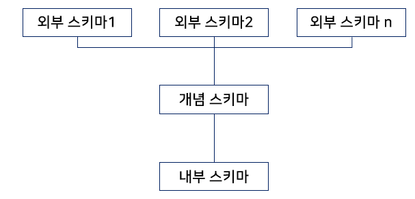
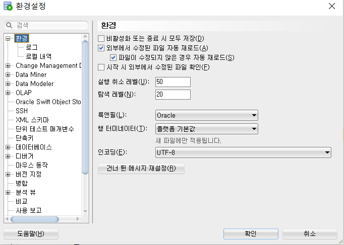

# SQL

## What is SQL ?

- Structured query language

- 데이터베이스와 대화하기 위해 특별히 디자인된 언어임.

- SQL database는 많은 회사에서 널리 쓰이고 있음. 

- SQL은 엑셀 시트와 유사하게 생겼음. 행 과 열이 존재하는 정형데이터임

- 실제로는 SQL은 Back-end에 있음. (Back-end  : 서버 쪽 처리 ↔ Front-end : 화면 처리 부분)

- SQL은 정보 시스템 개발 or 개발과 운영, 보안하는 사람도 익혀야함
  *모의 해킹을 하는 경우 SQL Injection 이라는 공격기법이 있다고함 (나중에 파봐야지.)*

  

SQL을 사용하려면  DBMS(DataBase Management system)를 설치 해야 한다.

DBMS 중 가장 많이 사용하는 **Oracle**을 이용해 실습을 해보자!

(사실 어떤 DBMS 를 설치해도 상관없습니다. 왜냐 SQL은 표준을 준수하기 때문이죠  👍)


일단 아래 링크에서 Oracle XE, sql developer 다운로드 후 설치하면 됩니다.

https://www.oracle.com/kr/database/technologies/xe-downloads.html

https://www.oracle.com/tools/downloads/sqldev-downloads.html



[참고] 

Non SQL :  SQL과 달리 행과 열으로 DB가 존재하지 않음. (document , graph , key - value로 DB 구성 )

ORM(object-relational-mapping) 이란?
 python 코드를 SQL 코드로 바꿔주는 역할을 함. 그렇기에 SQL을 배우지 않고, ORM에만 의존하는 경우가 많음


## DATA Modeling

### 데이터 모델링의 특징

- Absraction 추상화 -> 공통적인 특징을 찾고 간량하게 표현
- Simplification 단순화 -> 복잡한 문제를 피하고 누구나 이해할 수 있게 표현
- clarity 명확 -> 모호하지않게 명확히 표현

### 데이터 모델링의 단계

| 데이터 모델링 단계             | 설명                                                         |
| ------------------------------ | :----------------------------------------------------------- |
| Conceptual data modeling  개념 | - **전사적 관점**에서 기업의 데이터를 모델링.<br>- **추상화 수준이 가장 높은 수준의 모델링**.<br>- 계층 / 네트워크 / 관계형 모델에 관계없이 **업무측면에서 모델링** |
| Logical data modeling 논리     | - 특정 데이터베이스 모델에 종속<br>- 식별자를 정의하고 관계 속성을 표현<br>- 정규화를 통해서 **재사용성을 높임** |
| Physcial modeling 물리         | - 구출할 데이터베이스 관리 시스템에 테이블, 인덱스 등을 생성하는단계<br>- **성능, 보안, 가용성 등을 고려하여 데이터베이스를 구축** |

### 데이터 모델링 관점

| 관점              | 설명                                                         |
| ----------------- | ------------------------------------------------------------ |
| 데이터            | - 비지니스 프로세스에서 사용되는 데이터를 의미함 (구조분석, 정적분석) |
| 프로세스          | - 비즈니스 프로세스에서 수행하는 작업을 의미함 (시나리오 / 도메인/ 동적 분석) |
| 데이터와 프로세스 | - 프로세스와 데이터 간의 관계 (CRUD 분석 , create, read, update, delete) |

### 데이터 모델링을 위한 ERD

Peter chen이 entity relationship diagram 표기법을 만들었음. 

entity와 entity간의 관계를 정의하는 모델링 (ERwin Tools 과 같은 편집 툴 이용)

- ERD 작성절차

  *** 중요한 엔터티는 가급적 왼쪽 상단에 배치!

  1. 엔터티를 도출
  2. 엔터티를 배치
  3. 관계를 설정
  4. 관계명을 서술
  5. 관계 참여도를 표헌
  6. 관계의 필수 여부를 표헌

### 3층 스키마

사용자 , 설계자, 개발자가 데이터베이스를 보는 관점에 따라 데이터베이스를 기술하고 이들 간의 관계를 정의한 ANSI 표준임.

3층 스키마는 데이터베이스의 독립성을 확보하기 위한 방법임

데이터 독립성을 확보할 경우, 복잡도 감소 / 중복 제거/ 대응력 향상 / 유지보수 비용절감  등의 장점을 가짐

3단계 계층으로 분리해서 독립성을 확보하는 방법으로 각 계층을 뷰라고 함.


*** 논리적 독립성 : 개념 스키마가 변경되더라도 외부스키마는 영향 안받음

*** 물리적 독립성 : 내부스키마가 변경되더라도 개념스키마는 영향 안받음




### Entity

엔터티는 데이터 집합을 의미함 (즉 TABLE임)

엔터티의 특징은 아래와 같다.

- 유일한 식별자가 있어야함. (primary key)
- 2개 이상의 인스턴스가 있어야함. (인스턴스 = 행)
- 반드시 속성을 가지고 있어야함
- 다른 엔터티와 최소한 한개 이상 관계가 있어야함

#### 엔터티 종류

- 유형 엔터티  : 지속적으로 사용
- 무형 엔터티 : 개념적으로 사용
- 사건 엔터티 : 프로세스를 실행하면서 생성됨

#### 발생 시점에 따른 엔터티 종류

- 기본 엔터티 : 키 엔터티라고도 하며, 다른  엔터티로부터 영향 안받고 독립적으로 생성.
- 중심 엔터티 :  기본 엔터티와 행위 엔터티 중간에 존재
- 행위 엔터티 : 2개 이상의 엔터티로 부터 발생

### Attribute

인스턴스의 구성요소로 의미적으로 더이상 분해되지 않음. 

즉, 테이블 내 행을 구성하는 값들을 의미함.

### Relationship 

관계는 엔터티 간의 관련성을 의미함 . (존재 관계 / 행위 관계)

### Cardinality

두 엔터티 간에  관계에 참여하는 수 / 필수적 관계 =|  / 선택적 관계 =o 로 나타냄

*** M:N 관계의 join의 경우 카테시안 콥이 발생함. M:N 관계는 1:N , N:1으로 해소할 것!


## Function

### SELECT

#### IN / ALL / ANY

- IN ()

  하나라도 만족하는 경우 선택.

- ALL ()

  전체 값을 비교했을때 모두 만족하는 경우 선택. (ANY와 반대되는 개념)

- ANY ()

  하나라도 만족하는 경우 선택.

  IN과 달리 비교연산자를 사용함.

#### EXISTS / NOT EXISTS

- 상관관계 서브쿼리에서 사용하는 연산자

- 존재 여부에 따라 TRUE값을 반환


### DDL

- 데이터 정의어 , data definition language

- create, drop, alter, rename, truncate

  

- CREATE : 테이블 생성

- **ON DELETE CASCADE** 옵션은 자신이 참조하고있는 테이블의 데이터가 삭제되면 자동으로 자신도 삭제되는 옵션!

```SQL
-- TABLE (제약조건)
-- CONSTRAINT - **PK, FK, NOT NULL, CHECK, UNIQUE**
CREATE TABLE TABLE_NAME (
    COLUMN_NAME DATATYPE(SIZE) [DEFAULT , COLUMN_CONSTRAINT] ,
    COLUMN_NAME DATATYPE [OPTION] ,
    COLUMN_NAME DATATYPE [OPTION] ,
    COLUMN_NAME DATATYPE [OPTION]
    [TABLE_CONSTAINT ~ ]
)

-- EXAMPLE
CREATE TABLE TEST_TBL(
    ID NUMBER(5)        PRIMARY KEY,
    NAME VARCHAR2(50)   NOT NULL,
    ADDRESS VARCHAR2(100),
    REGDATE DATE DEFAULT SYSDATE
);
```

- DELETE : 테이블 삭제
- **CASCADE CONSTARINT**  

```SQL
DROP TABLE TEST_TBL
```

- ALTER : 테이블 변경 / 칼럼 추가,변경,삭제 

```SQL
-- 테이블 명 변경
ALTER TABLE TABLE_NAME
RENAME TO NEW_NAME;

-- 칼럼추가
ALTER TABLE TABLE_NAME
ADD (AGEE NUMBER (2) DEFAULT 1);

-- 칼럼변경 (기존의 데이터가 존재하는 경우 ERROR)
ALTER TABLE TABLE_NAME
MODIFY (ENAME VARCHAR2(40) NOT NULL);

-- 칼럼 삭제
ALTER TABLE EMP
DROP  COLUMN AGE ;

-- 칼럼 명 변경
ALTER TABLE EMP
RENAME COLUMN ENAME	TO NEW_ENAME
```


### DML

데이터 조작어 (data manipulation)

- INSERT, UPDATE, DELETE / SELECT

```sql
-- INSERT INTO TABLE_NAME([COLUMN LIST]) VALUES(단일행 SUBQUERY, VALUE, ~~~)

INSERT INTO TEST_TBL VALUES('100', 'OMY', NULL, NULL)
INSERT INTO TEST_TBL VALUES('101', 'OMY', NULL, NULL)
INSERT INTO TEST_TBL (ID, NAME, ADDRESS) VALUES('102', 'OMY', NULL)


-- UPDATE  TABLE_NAME
-- SET     COLUMN = (SUBQUERY , DEFAULT), COLUMN = (SUBQUERY , DEFAULT)
-- WHERE   CONDITION

UPDATE  EMPLOYEE
SET     JOB_ID = (SELECT JOB_ID FROM EMPLOYEE WHERE EMP_NAME = '성해교') , DEPT_ID = '50'
WHERE   EMP_NAME = '심하균'

-- DELETE  [FROM] TABLE_NAME
-- WHERE   CONDITION ;


```

### DCL

- 데이터 제어어 , data control language
- grant, revoke

### TCL

- 트랜젝션 제어어 , transaction control language

- commit , rollback , savepoint

  

## FAQ

####  Oracle SQL Developer 한글 깨짐현상

github에 sql script 를 push 할 경우, 인코딩 문제로 한글 깨짐현상이 일어난다. 이를 해결 해보자 !

**sqldeveloper** 실행 > 도구 > 환경설정 > 환경 > 인코딩 : UFT-8으로 변경



#### SQL 성능향상을 위한 Join의 이해

=> 기준 테이블은 recode 수가 적은 것을 먼저하는게 더 낫다.

하나의 테이블을 기준으로 순차적으로 상대 테이블의 row를 결합하여 원하는 결과를 추출하는 테이블 join 방식

- DRIVING 테이블 : 결합하기위한 기준 테이블
- DRIVEN 테이블 : 결합되기 위한 테이블


## 참고자료

- ERwin : ERD 생성에 사용하는 Tool